# Data Management
## Laboratory 01
###### Students: *Romain Claret & Simon Martinez*
###### Professor: *Dr. Fatemeh Borran*
###### Assistant: *Gary Marigliano*
###### Due-date: *Monday 15 October 2018*
  

---

### *(D)* Understanding the Lucene API

1. Yes, the demo uses the default stopword removal
    - QueryParser takes as argument a [StandardAnalyzer()](http://lucene.apache.org/core/6_6_1/core/org/apache/lucene/analysis/standard/StandardAnalyzer.html?is-external=true) which is built by default with a default list of stopwords [`STOP_WORDS_SET`](http://lucene.apache.org/core/6_6_1/core/org/apache/lucene/analysis/standard/StandardAnalyzer.html#STOP_WORDS_SET)
    - Proof: "frame" and "the frame" is giving the same output

2. No, the demo is not using any form of stemming
    - StandardAnalyzer doesn’t provide a stemming by default
    - We couldn’t find any stemming library into demo code
    - We didn’t fine any custom/manual stemming in the demo code
    - Proof: "frame" and "frames" doesn’t give the same output

3. Yes, demo is case insensitive
    - StandarAnalyzer use [LowerCaseFilter](https://lucene.apache.org/core/6_1_0/analyzers-common/org/apache/lucene/analysis/core/LowerCaseFilter.html) which normalizes tokens text into lower case format.
    - Proof : "test" and "TEST" give the same output

4. Yes, it does matter
    - In case of Normalisation: taking the words "been" and "being" as example, the normalisation of those words is "be", which is part of the [`STOP_WORDS_SET`](http://lucene.apache.org/core/6_6_1/core/org/apache/lucene/analysis/standard/StandardAnalyzer.html#STOP_WORDS_SET). We could lose information if the stemming is done before the normalisation.
    - Depends: If the stopwords are stemmed then we should stem first then apply the stopwords filter. Otherwise we would do the inverse.

--- 
# TODO

### *(E)* Using Luke
### *(F)* Indexing and Searching the CACM collection
#### Indexing
Based on the [FieldType](http://lucene.apache.org/core/6_6_1/core/org/apache/lucene/document/FieldType.html) documentation 
- `fieldType.setStoreTermVectorOffsets(true);`
    - Store token character offsets into the term vector for this field.
- `fieldType.setStoreTermVectorPayloads(true);`
    - Store token payloads into the term vector for this field.
- `fieldType.setStoreTermVectorPositions(true);`
    - Store token positions into the term vector for this field.
- `fieldType.setStoreTermVectors(true);`
    - Store the indexed form into term vectors for this field.
#### Using different Analyzers
- **StandardAnalyzer**
    - 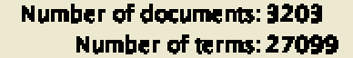
    - 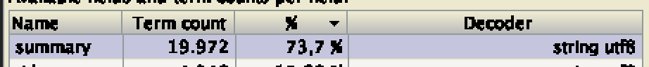
    - 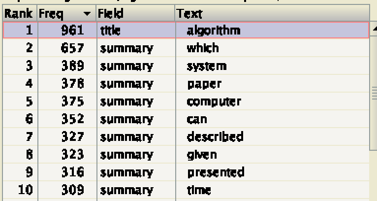
    - 
    - Indexing time: 1294ms
- **WhitespaceAnalyzer**
    - 
    - 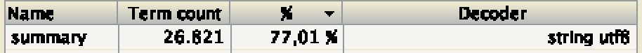
    - 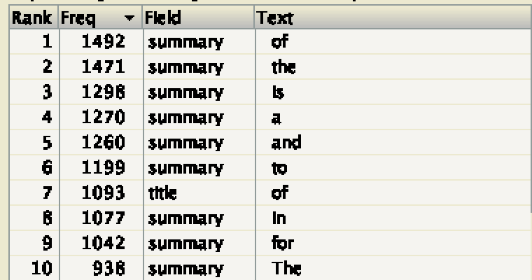
    - 
    - Indexing time: 1453ms
- **EnglishAnalyzer**
    - 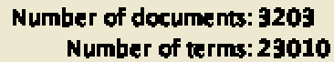
    - 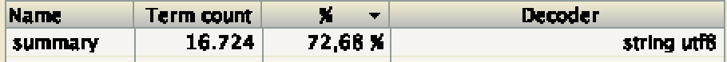
    - 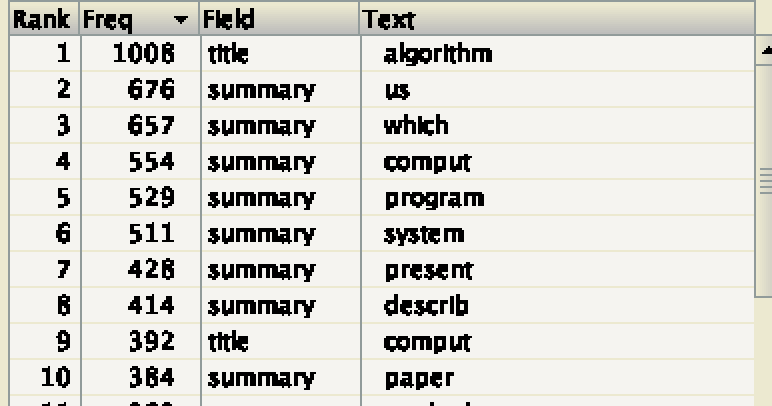
    - 
    - Indexing time: 1386ms
- **ShingleAnalyzerWrapper (shingle size 2)**
    - 
    - 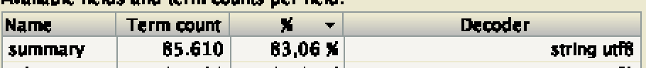
    - 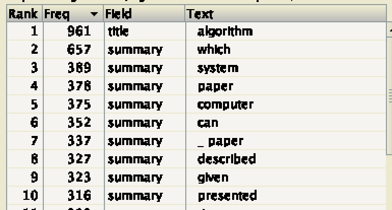
    - 
    - Indexing time: 2181ms
- **ShingleAnalyzerWrapper (shingle size 3)**
    - 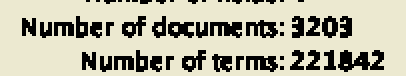
    - 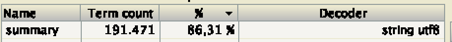
    - 
    - 
    - Indexing time: 2863ms
- [**StopAnalyzer**](http://lucene.apache.org/core/2_9_4/api/all/org/apache/lucene/analysis/StopAnalyzer.html)
    - 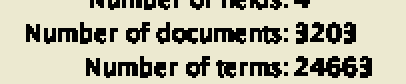
    - 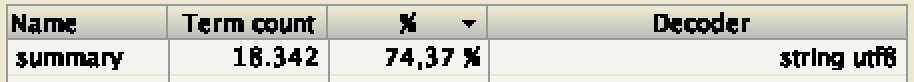
    - 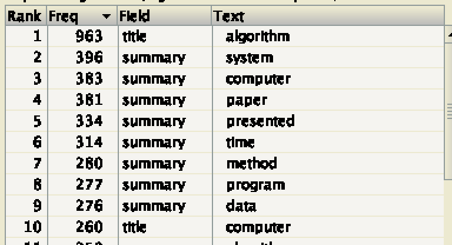
    - 
    - Indexing time: 1188ms
#### Reading Index
#### Searching
#### Tuning the Lucene Score
