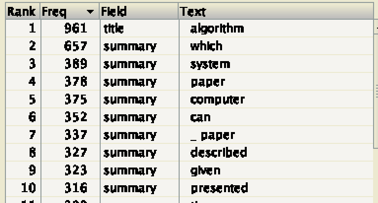

# Data Management
## Laboratory 01
###### Students: *Romain Claret & Simon Martinez*
###### Professor: *Dr. Fatemeh Borran*
###### Assistant: *Gary Marigliano*
###### Due-date: *Monday 15 October 2018*
<br/><br/>

---

### *(D)* Understanding the Lucene API

1. Yes, the demo uses the default stopword removal
    - QueryParser takes as argument a [StandardAnalyzer()](http://lucene.apache.org/core/6_6_1/core/org/apache/lucene/analysis/standard/StandardAnalyzer.html?is-external=true) which is built by default with a default list of stopwords [`STOP_WORDS_SET`](http://lucene.apache.org/core/6_6_1/core/org/apache/lucene/analysis/standard/StandardAnalyzer.html#STOP_WORDS_SET)
    - Proof: "frame" and "the frame" is giving the same output

2. No, the demo is not using any form of stemming
    - StandardAnalyzer doesn’t provide a stemming by default
    - We couldn’t find any stemming library into demo code
    - We didn’t fine any custom/manual stemming in the demo code
    - Proof: "frame" and "frames" doesn’t give the same output

3. Yes, demo is case insensitive
    - StandarAnalyzer use [LowerCaseFilter](https://lucene.apache.org/core/6_1_0/analyzers-common/org/apache/lucene/analysis/core/LowerCaseFilter.html) which normalizes tokens text into lower case format.
    - Proof : "test" and "TEST" give the same output

4. Yes, it does matter
    - In case of Normalisation: taking the words "been" and "being" as example, the normalisation of those words is "be", which is part of the [`STOP_WORDS_SET`](http://lucene.apache.org/core/6_6_1/core/org/apache/lucene/analysis/standard/StandardAnalyzer.html#STOP_WORDS_SET). We could lose information if the stemming is done before the normalisation.
    - Depends: If the stopwords are stemmed then we should stem first then apply the stopwords filter. Otherwise we would do the inverse.

---
# TODO

### *(E)* Using Luke
### *(F)* Indexing and Searching the CACM collection
#### Indexing
Based on the [FieldType](http://lucene.apache.org/core/6_6_1/core/org/apache/lucene/document/FieldType.html) documentation 
- `fieldType.setStoreTermVectorOffsets(true);`
    - Store token character offsets into the term vector for this field.
- `fieldType.setStoreTermVectorPayloads(true);`
    - Store token payloads into the term vector for this field.
- `fieldType.setStoreTermVectorPositions(true);`
    - Store token positions into the term vector for this field.
- `fieldType.setStoreTermVectors(true);`
    - Store the indexed form into term vectors for this field.
#### Using different Analyzers
- **StandardAnalyzer**
    - 
    - 
    - 
    - 
    - Indexing time: 1294ms
- **WhitespaceAnalyzer**
    - 
    - 
    - 
    - 
    - Indexing time: 1453ms
- **EnglishAnalyzer**
    - 
    - 
    - 
    - 
    - Indexing time: 1386ms
- **ShingleAnalyzerWrapper (shingle size 2)**
    - 
    - 
    - 
    - 
    - Indexing time: 2181ms
- **ShingleAnalyzerWrapper (shingle size 3)**
    - 
    - 
    - 
    - 
    - Indexing time: 2863ms
- [**StopAnalyzer**](http://lucene.apache.org/core/2_9_4/api/all/org/apache/lucene/analysis/StopAnalyzer.html)
    - 
    - 
    - 
    - 
    - Indexing time: 1188ms
#### Reading Index
1. What is the author with the highest number of publications? How many publications does he/she have?
    - 38 **Thacher Jr., H. C.**
2. List the top 10 terms in the title field with their frequency.
    - 
#### Searching

- QueriesPerformer.query function

```java
System.out.println("Searching for [" + q +"]");
ComplexPhraseQueryParser parser = new ComplexPhraseQueryParser("summary",this.analyzer);
try {
   Query query = parser.parse(q);
   try {
              TopDocs search = this.indexSearcher.search(query, 10);
              System.out.printf("Total Results : %d\n",search.totalHits);
              for (int i=0; i< 10 ; i++){
                  System.out.printf("%s : %s (%f)\n",search.scoreDocs[i].doc,this.indexReader.document(search.scoreDocs[i].doc).get("title"),search.scoreDocs[i].score);
              }
   }
   catch (IOException ex_search){
      System.out.println(ex_search);
   }
}
catch (ParseException ex_parse){
   System.out.println(ex_parse);
}
```

- Output

Searching for [Information Retrieval]
Total Results : 188
1456 : Data Manipulation and Programming Problemsin Automatic Information Retrieval (8,651913)
890 : Everyman's Information Retrieval System (8,181953)
1698 : Experimental Evaluation of InformationRetrieval Through a Teletypewriter (7,574708)
2306 : Dynamic Document Processing (7,358763)
3133 : The Use of Normal Multiplication Tablesfor Information Storage and Retrieval (7,355752)
1031 : Theoretical Considerations in Information Retrieval Systems (7,312654)
1934 : Randomized Binary Search Technique (7,106321)
1680 : Easy English,a Language for InformationRetrieval Through a Remote Typewriter Console (6,702070)
2989 : Effective Information Retrieval Using Term Accuracy (6,702070)
2518 : On the Problem of Communicating Complex Information (6,249776)

Searching for [Information AND Retrieval]
Total Results : 23
1456 : Data Manipulation and Programming Problemsin Automatic Information Retrieval (8,651913)
890 : Everyman's Information Retrieval System (8,181953)
1698 : Experimental Evaluation of InformationRetrieval Through a Teletypewriter (7,574708)
2306 : Dynamic Document Processing (7,358763)
3133 : The Use of Normal Multiplication Tablesfor Information Storage and Retrieval (7,355752)
1031 : Theoretical Considerations in Information Retrieval Systems (7,312654)
1934 : Randomized Binary Search Technique (7,106321)
1680 : Easy English,a Language for InformationRetrieval Through a Remote Typewriter Console (6,702070)
2989 : Effective Information Retrieval Using Term Accuracy (6,702070)
2518 : On the Problem of Communicating Complex Information (6,249776)

Searching for [+Retrieval Information -Database]
Total Results : 54
1456 : Data Manipulation and Programming Problemsin Automatic Information Retrieval (8,651913)
890 : Everyman's Information Retrieval System (8,181953)
1698 : Experimental Evaluation of InformationRetrieval Through a Teletypewriter (7,574708)
2306 : Dynamic Document Processing (7,358763)
3133 : The Use of Normal Multiplication Tablesfor Information Storage and Retrieval (7,355752)
1031 : Theoretical Considerations in Information Retrieval Systems (7,312654)
1934 : Randomized Binary Search Technique (7,106321)
1680 : Easy English,a Language for InformationRetrieval Through a Remote Typewriter Console (6,702070)
2989 : Effective Information Retrieval Using Term Accuracy (6,702070)
2518 : On the Problem of Communicating Complex Information (6,249776)

Searching for [Info*]
Total Results : 193
221 : Coding Isomorphisms (1,000000)
271 : A Storage Allocation Scheme for ALGOL 60 (1,000000)
395 : Automation of Program  Debugging (1,000000)
396 : A Card Format for Reference Files in Information Processing (1,000000)
408 : CL-1, An Environment for a Compiler (1,000000)
439 : Record Linkage (1,000000)
482 : On the Nonexistence of a Phrase Structure Grammar for ALGOL 60 (1,000000)
615 : An Information Algebra - Phase I Report-LanguageStructure Group of the CODASYL Development Committee (1,000000)
643 : A String Language for Symbol Manipulation Based on ALGOL 60 (1,000000)
654 : COMIT as an IR Language (1,000000)

Searching for [Information Retrieval~5]
Total Results : 191
1456 : Data Manipulation and Programming Problemsin Automatic Information Retrieval (7,194777)
890 : Everyman's Information Retrieval System (6,724819)
2831 : Faster Retrieval from Context Trees (Corrigendum) (6,458653)
3133 : The Use of Normal Multiplication Tablesfor Information Storage and Retrieval (6,334777)
1698 : Experimental Evaluation of InformationRetrieval Through a Teletypewriter (6,215545)
2306 : Dynamic Document Processing (6,202866)
1031 : Theoretical Considerations in Information Retrieval Systems (6,081074)
1934 : Randomized Binary Search Technique (5,909492)
2159 : Canonical Structure in Attribute Based File Organization (5,628992)
2518 : On the Problem of Communicating Complex Information (5,344692)

#### Tuning the Lucene Score

```java
//tf : 1+log(⁡freq)
@Override
public float tf(float freq){
    return (float) (1 + Math.log(freq));
}

//idf : log(numDocs/docFreq+1)+1
@Override
public float idf(long docFreq, long numDocs){
    return (float) (Math.log(numDocs / (docFreq + 1)) + 1);
}

//lengthNorm : 1
@Override
public float lengthNorm(FieldInvertState fieldInvertState) {
    return (float) 1;
}

//coord : squart(overlap/maxOverlap)
@Override
public float coord(int overlap, int maxOverlap){
    return (float) Math.sqrt(overlap / maxOverlap);
}
```